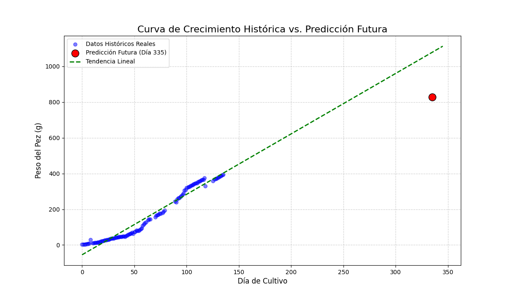

# Informe de Proyecto: Modelo Predictivo del Peso de Peces en Acuaponía

---

## 1. Datos y Preprocesamiento

### 1.1. Elección y Descripción del Dataset

**Fuente:** [Sensor Based Aquaponics Fish Pond Datasets en Kaggle](https://www.kaggle.com/datasets/ogbuokiriblessing/sensor-based-aquaponics-fish-pond-datasets/data)

Para este proyecto, se seleccionó el conjunto de datos "Sensor Based Aquaponics Fish Pond Datasets", que contiene más de un millón de registros de sistemas acuapónicos. La riqueza y el contexto de estos datos los hacen ideales para desarrollar un modelo predictivo realista y robusto.

Durante la exploración inicial, se identificaron varias inconsistencias que requerían un preprocesamiento exhaustivo:

- **Disponibilidad de archivos:** El proveedor mencionaba 12 datasets, pero solo 11 estaban disponibles para la descarga.
- **Formato de Fechas:** Las marcas de tiempo no estaban estandarizadas, presentando zonas horarias mixtas (UTC y CET).
- **Nombres de Columnas:** Existían inconsistencias en los títulos de las columnas entre los diferentes archivos, lo que impedía una unificación directa.

### 1.2. Flujo de Trabajo del Procesamiento de Datos

Para solucionar estos problemas, se implementó un script de Python cuyo flujo de trabajo se dividió en tres fases principales:

1.  **Limpieza Individual (`función clear`):** Tratamiento de cada archivo de tanque de forma aislada para corregir errores, manejar valores atípicos y estandarizar formatos.
2.  **Unificación (`función unir`):** Consolidación de todos los archivos limpios en un único dataset maestro.
3.  **Agregación Diaria (`función daily`):** Resumen de los datos a una frecuencia diaria para analizar tendencias a largo plazo y reducir el ruido.

#### Fase 1: Limpieza y Estandarización por Archivo

Esta fue la fase más crítica. Se aplicó la siguiente lógica a cada archivo:

- **Preparación Inicial:**

  - La columna `Datetime` se convirtió a un formato de fecha y hora estándar y se **estandarizó a la zona horaria UTC** para asegurar consistencia.
  - Se eliminaron las filas donde `Datetime` o la variable objetivo `Fish_Weight(g)` eran nulas, garantizando que cada registro tuviera una marca de tiempo válida y una respuesta real para el entrenamiento del modelo.

- **Estrategia Híbrida para Outliers:**
  Para cada variable de sensor, se combinó la estadística con el conocimiento del dominio. Se calcularon los límites usando el **Rango Intercuartílico (IQR)**, pero estos fueron validados y, en casos necesarios, **sobrescritos por límites manuales realistas** (ej. la turbidez no puede superar los 100 NTU). Esto previno que los datos de mala calidad sesgaran la detección de outliers. Cualquier valor fuera de estos límites validados se marcó como `NaN`.

- **Imputación de Datos Faltantes:**
  Se optó por un método sofisticado para preservar las tendencias temporales en los datos:

  1.  **Interpolación Lineal (`.interpolate()`):** Rellenó la mayoría de los huecos estimando los valores de manera gradual entre dos puntos conocidos.
  2.  **Relleno Hacia Atrás (`.fillna(method='bfill')`):** Solucionó el problema de los valores `NaN` al inicio del dataset, rellenándolos con el primer valor válido posterior.

- **Ingeniería de Características (`Feature Engineering`):**
  Para potenciar el modelo, se crearon dos nuevas características a partir de `Fish_Length(cm)`:
  - **`Length_Squared` ($L^2$):** La longitud al cuadrado.
  - **`Length_Cubed` ($L^3$):** La longitud al cubo.
    Esta última es fundamental, ya que la relación entre la longitud (1D) y el peso (una propiedad 3D dependiente del volumen) de un pez es inherentemente cúbica.

#### Fase 2: Unificación y Agregación

- **Unificación:** Se utilizó `pd.concat()` para apilar todos los DataFrames limpios en uno solo, reiniciando el índice para asegurar la integridad del dataset final.
- **Agregación Diaria:** Se empleó `.resample('D').mean()` para consolidar los datos en promedios diarios, enfocando el modelo en las tendencias de crecimiento a largo plazo y reduciendo el ruido de las mediciones de alta frecuencia.

---

## 2. Modelo de Red Neuronal (ANN)

Se diseñó una Red Neuronal Artificial (ANN) simple utilizando Keras para predecir el peso de los peces. Durante el desarrollo inicial, se observó un comportamiento problemático en las predicciones.

### 2.1. Problema Inicial: Sesgo en las Predicciones

Las primeras versiones del modelo mostraban un sesgo significativo: eran incapaces de predecir pesos por debajo de un umbral aproximado de 170g, a pesar de que el dataset contenía abundantes datos de peces más pequeños. Esto se manifestaba en la gráfica de predicciones como un "suelo" artificial bajo el cual no caía ninguna predicción.

### 2.2. Solución: Cambio de la Función de Activación

El análisis del problema reveló que la causa no era el desbalance de los datos, sino una configuración incorrecta en la arquitectura de la red. La capa de salida del modelo probablemente utilizaba una función de activación restrictiva como `ReLU` o `Sigmoid`.

- **Funciones Restrictivas (`ReLU`, `Sigmoid`):** Estas funciones limitan el rango de salida de una neurona. `Sigmoid`, por ejemplo, "aplasta" cualquier valor para que quepa en un rango de 0 a 1. Esto imponía una "jaula" matemática a las predicciones, impidiendo que el modelo generara valores bajos, incluso cuando los datos de entrada lo sugerían.

- **La Solución (`Linear`):** La corrección consistió en cambiar la función de activación de la capa de salida a **`linear`**. La activación lineal (`f(x) = x`) no aplica ninguna transformación al resultado final. Simplemente permite que la neurona de salida produzca cualquier valor real que la red haya calculado tras su complejo procesamiento interno.

Este cambio eliminó la restricción artificial y le dio al modelo la libertad necesaria para predecir todo el espectro de pesos. Como resultado, el sesgo desapareció y el rendimiento del modelo mejoró drásticamente, **reduciendo el error relativo de un ~54% a un excelente ~13%**.

### Siguiente Paso:

El modelo actual no predice el crecimiento del pez a futuro, sino que estima el peso en función de las condiciones actuales del tanque. Para avanzar, se planea implementar un modelo de series temporales que pueda predecir el crecimiento futuro basándose en las tendencias históricas de los datos.

Para probar la capacidad de pronóstico del modelo, se realizó un experimento de predicción a 200 días en el futuro (Día 335). Se trató de hacer esta predicción simulando los datos de las variables ambientales de manera lineal desde el último día registrado en el dataset hasta el día objetivo.

Los datos de entrada generados para el día 335 fueron los siguientes:

| Temperature(C) | Turbidity(NTU) | Dissolved_Oxygen(mg/L) | PH         | Ammonia(mg/L) | Nitrate(mg/L) | Dia_Cultivo | Population |
| :------------- | :------------- | :--------------------- | :--------- | :------------ | :------------ | :---------- | :--------- |
| 26.703102      | 70.912634      | 2.319174               | -10.083281 | 1.286859      | 512.059972    | 335         | 50.0       |

Con esta entrada, el resultado de la predicción fue:

**El peso estimado del pez para el día 335 es: 827.09 gramos.**

#### Análisis de Resultados y Métricas de Rendimiento

Las métricas de rendimiento del modelo, calculadas sobre el conjunto de datos históricos de prueba, son notablemente altas, lo que indica que el modelo es muy eficaz para ajustar y explicar los datos del pasado.

| Métrica            | Valor      |
| :----------------- | :--------- |
| **R²**             | **0.9589** |
| RMSE               | 26.3791    |
| MAE                | 19.4693    |
| MSE                | 695.8560   |
| Error Relativo (%) | 10.0333    |

Se generó un gráfico para visualizar la predicción futura en el contexto de los datos históricos y la tendencia lineal aprendida por el modelo.

##### Gráfico de Proyección Futura

A primera vista, la gráfica podría validar la predicción del peso, ya que el punto futuro (827.09 g) se ubica en una zona donde la línea de tendencia esta proyectada (tomando en cuenta que el crecimiento no es siempre lineal). Sin embargo, este resultado debe ser interpretado con extrema cautela debido a las importantes limitaciones del enfoque.

#### Limitaciones Encontradas y Conclusión

El análisis revela varias limitaciones críticas que impiden confiar en el modelo actual como una herramienta de pronóstico fiable:

- **El Crecimiento No es Lineal:** La principal limitación es la suposición de que el crecimiento de un pez es lineal. Los sistemas biológicos siguen curvas de crecimiento tipo "S" (logísticas), donde el crecimiento se desacelera con el tiempo. El modelo actual no puede capturar esta realidad.
- **Datos de Entrada Simulados:** La predicción se basa en datos de entrada (`Temperatura`, `PH`, etc.) que fueron generados por un modelo lineal simple, no son datos reales. La calidad de la predicción de peso depende enteramente de la calidad de esta simulación inicial.
- **Riesgo de Extrapolación:** El modelo está proyectando una tendencia muy lejos de la zona donde fue entrenado, lo que aumenta exponencialmente la probabilidad de error.

El modelo ANN actual es un **excelente regresor** para datos existentes pero un **pronosticador poco fiable** para el futuro. El alto valor de R² refleja su capacidad para ajustar el pasado, no para predecir el futuro.

Debido a las limitaciones expuestas, se continuará con la implementación de una arquitectura de red neuronal diseñada específicamente para manejar datos secuenciales y aprender tendencias temporales no lineales. Una de las opciones más adecuada es una **Red Neuronal Recurrente (RNN)**, y más específicamente, una de tipo **Long Short-Term Memory (LSTM)**.

Un modelo LSTM sería capaz de:

- Aprender la forma de la curva de crecimiento no lineal.
- Dar más importancia a los datos recientes para predecir el futuro inmediato.
- Modelar la evolución conjunta de todas las variables a lo largo del tiempo, en lugar de tratarlas como una foto estática.
