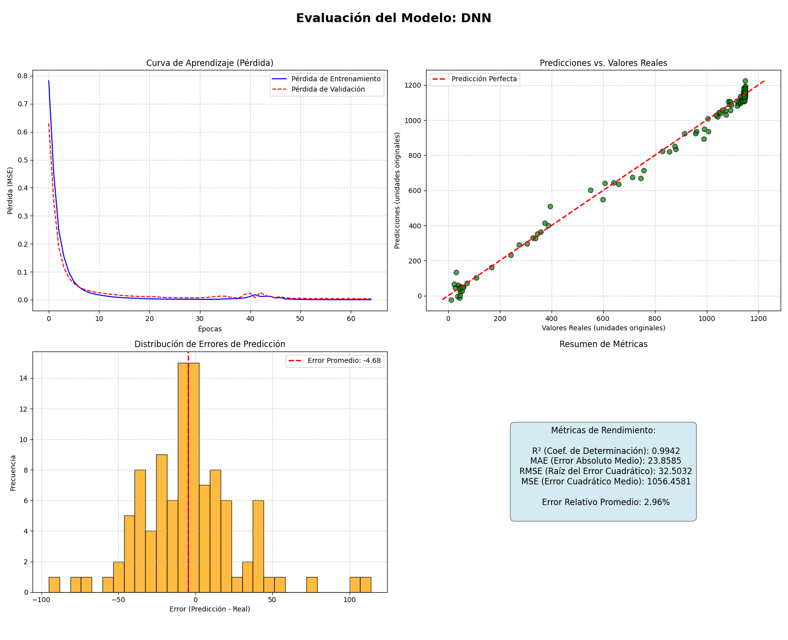

# Informe de Resultados de Entrenamiento

- **Modelo:** `DNN`
- **Fecha de Ejecución:** `2025-07-07 18:59:07`

---

## 1. Configuración del Experimento

| Parámetro | Valor |
|---|---|
| Archivo de Datos | `No especificado` |
| Semilla Aleatoria (Seed) | `No especificado` |
| Épocas Máximas Config. | `300` |
| Tamaño de Lote (Batch Size) | `32` |
| **Época de Detención (real)** | **65** |
| **Duración del Entrenamiento** | **0 min y 7 seg** |

---

## 2. Arquitectura del Modelo

A continuación se muestra la arquitectura detallada de la red neuronal utilizada:

```
Model: "sequential_1"
┏━━━━━━━━━━━━━━━━━━━━━━━━━━━━━━━━━━━━━━┳━━━━━━━━━━━━━━━━━━━━━━━━━━━━━┳━━━━━━━━━━━━━━━━━┓
┃ Layer (type)                         ┃ Output Shape                ┃         Param # ┃
┡━━━━━━━━━━━━━━━━━━━━━━━━━━━━━━━━━━━━━━╇━━━━━━━━━━━━━━━━━━━━━━━━━━━━━╇━━━━━━━━━━━━━━━━━┩
│ Capa_Oculta_1 (Dense)                │ (None, 128)                 │           1,024 │
├──────────────────────────────────────┼─────────────────────────────┼─────────────────┤
│ Capa_Oculta_2 (Dense)                │ (None, 64)                  │           8,256 │
├──────────────────────────────────────┼─────────────────────────────┼─────────────────┤
│ Capa_Oculta_3 (Dense)                │ (None, 32)                  │           2,080 │
├──────────────────────────────────────┼─────────────────────────────┼─────────────────┤
│ Capa_Salida (Dense)                  │ (None, 1)                   │              33 │
└──────────────────────────────────────┴─────────────────────────────┴─────────────────┘
 Total params: 34,181 (133.52 KB)
 Trainable params: 11,393 (44.50 KB)
 Non-trainable params: 0 (0.00 B)
 Optimizer params: 22,788 (89.02 KB)

```

---

## 3. Métricas de Rendimiento Final

Estas métricas fueron calculadas sobre el conjunto de prueba, utilizando los pesos del modelo que obtuvieron el mejor rendimiento en el conjunto de validación.

| Métrica | Valor |
|---|---|
| **R² (Coef. de Determinación)** | **0.9942** |
| RMSE (Raíz del Error Cuadrático) | 32.5032 |
| MAE (Error Absoluto Medio) | 23.8585 |
| MSE (Error Cuadrático Medio) | 1056.4581 |
| Error Relativo Promedio | 2.96% |

---

## 4. Gráficos de Evaluación

La siguiente imagen muestra las curvas de aprendizaje, la comparación entre valores reales y predichos, y la distribución de los errores.



### Análisis de la Curva de Aprendizaje

- **Pérdida de Entrenamiento (Azul):** Muestra cómo disminuye el error del modelo en los datos que está viendo para aprender.
- **Pérdida de Validación (Roja):** Muestra el error del modelo en datos que no ha usado para aprender. Es el indicador más importante de la capacidad de generalización del modelo. Si esta curva empieza a subir mientras la azul baja, es un síntoma de sobreajuste.

